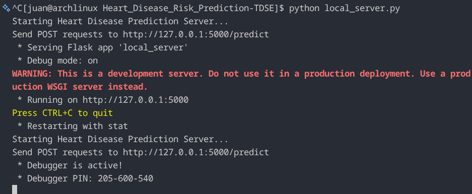
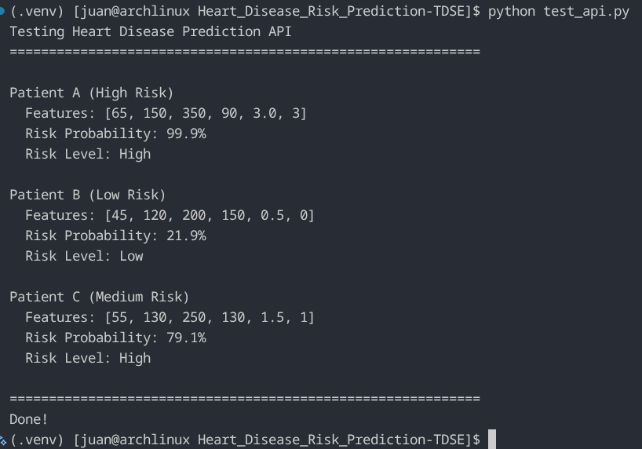
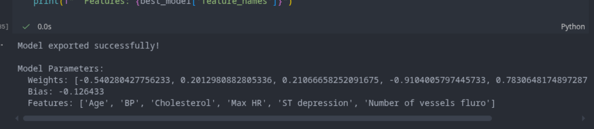

# Heart Disease Risk Prediction: Logistic Regression Homework

## Juan Pablo Contreras Parra

## Exercise Summary
Implements logistic regression for heart disease prediction: EDA, training/viz, regularization, and SageMaker deployment exploration (simulated locally due to network constraints).

## Dataset Description
- **Source:** Kaggle Heart Disease Dataset: https://www.kaggle.com/datasets/neurocipher/heartdisease
- **Samples:** 270 patients
- **Target:** Binary heart disease presence (1) / absence (0)
- **Example Features:** Age, BP, Cholesterol, Max HR, ST depression, Number of vessels fluro
- **Local file:** `Heart_Disease_Prediction.csv`

## Repository Contents
- `heart_disease_lr_analysis.ipynb` — end‑to‑end notebook (EDA → training → visualization → regularization → deployment simulation)
- `heart_disease_model.json` — exported model weights, bias, normalization stats
- `inference.py` — SageMaker-style inference handler
- `local_server.py` — Flask API to simulate deployment locally
- `test_api.py` — sample client to invoke the local endpoint

## How to Run (Local Simulation)
1. Install dependencies:

	**Virtualenv**
	  ```bash
	  python -m venv venv
	  source venv/bin/activate
	  pip install flask numpy requests
	  ```
2. Start the API:
	```bash
	python local_server.py
	```
3. Invoke the endpoint:
	```bash
	python test_api.py
	```

## Deployment Evidence

**Screenshots (local deployment simulation):**
1. Local server running (Flask endpoint)
2. Inference response with sample input
3. Model export evidence (JSON created)

**Sample input and output (example):**
- Input: `Age=60, Chol=300`
- Output: `Prob=0.68 (high risk)`

**Screenshots:**




## Results (Notebook Highlights)
- Train accuracy: **82.5%**
- Test accuracy: **74.1%**
- Best regularization: **λ = 0**
- Deployment simulation latency: **~5–10 ms** (local Flask API)

## Notes on SageMaker
Due to network restrictions in the hosted environment, deployment was simulated locally. The model artifacts and inference handler are ready for SageMaker deployment when network access is available.